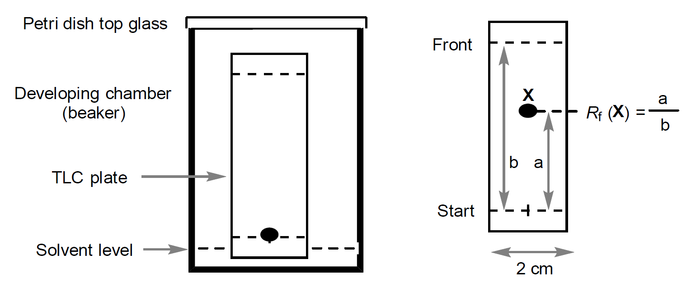

# 문제 1. Benzil의 환원
## 시약
+	벤질 (Benzil), 500mg
+	95% 에탄올 (Ethanol) (w/w), 5mL
+	수소화붕소나트륨 (Sodium Borohydride), 100mg
+	헥세인(Hexane)/에틸 아세테이트(Ethyl acetate) 6:1혼합물 (TLC 이동상), 5mL
## 기구 및 초자 (개수)
+	삼각플라스크 (Erlenmeyer flask), 100mL
+	약수저 (Spatula)
+	메스실린더 (Masuring cylinders), 10mL
+	TLC 챔버 (TLC chamber)
+	TLC 판 (TLC plates)
+	모세관 (Capillary) (2)
+	비커 100mL (2)
+	물 배스 및 클립 (Water bath with paper clip)
+	얼음 배스 (ice bath)
+	뷰흐너 깔때기 (Buchner funnel)와 감압장치
## 실험 과정
1. 약수저를 이용하여 500mg의 벤질을 100mL 삼각플라스크에 옮겨 담는다. (TLC 분석을 위해 소량의 벤질을 남겨놓는다.) 5mL의 95%에탄올을 삼각플라스크에 첨가하고 가열하여 완전히 녹인다.

2. ice bath에서 플라스크를 식혀준 후 100mg 수소화붕소나트륨을 약수저를 이용하여 8-10번에 나누어 5분간 첨가한다.

3. 플라스크를 ice bath에서 꺼내어 상온에서 반응이 진행되도록 하며 색의 변화를 관찰한다. 30mL의 증류수를 80℃로 가열한다.

4. 10분 뒤에 80℃의 증류수 10mL를 플라스크에 첨가하고 hot plate에서 10분간 가열하여 끓여준다.

5. 끓는 물 10mL를 더 첨가하고 상온에서 식혀준다. 상온에 도달하면 플라스크를 ice bath에 담근 후 결정이 나타날 때까지 기다린다.

6. 고체를 감압여과하고 이를 5mL 얼음물로 2번 씻어준 후 oven에서 건조시킨다.

7. 전개액을 TLC 챔버에 넣은 후 덮개로 덮는다. 반응물(Benzil)과 생성물을 각각 에탄올에 녹인 후 모세관을 이용해 TLC 판에 각각 점 찍는다. TLC 판을 TLC 챔버에 넣고, 전개액이 전개될 때까지 기다린다. 전개액이 올라간 부분을 연필로 표시하고 반응물과 생성물의 Rf를 계산한다.

## 데이터 분석 및 질문
1. 생성물의 이론상 수득률을 mg 단위로 계산하라.

2. 생성물의 실험상 수득률을 %단위로 계산하라.

3. 반응물과 생성물의 Rf값을 계산과정과 함께 적어라.

4. 생성물의 구조를 나타내어라.

